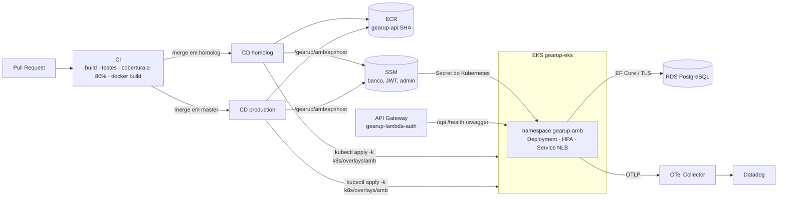

# GearUp

API REST para gestão de oficina mecânica, construída em .NET 10, PostgreSQL, DDD e Clean Architecture.

Na Fase 1 nasceu o domínio (ordens de serviço, orçamentos, estoque); na Fase 2 a aplicação virou cloud native (Docker, Kubernetes, Terraform, CI/CD, HPA). Na **Fase 3** ela opera em nível corporativo: **API Gateway**, **autenticação serverless por CPF**, **banco gerenciado**, **observabilidade com Datadog** e a plataforma separada em **quatro repositórios** com CI/CD e deploy automático de homologação e produção.

## Repositórios da plataforma

| Repositório | Propósito |
|---|---|
| **[gearup-api](https://github.com/SOAT-GearUp/gearup-api)** (este) | API, testes, manifests Kubernetes, pipeline de deploy no EKS e documentação arquitetural |
| [gearup-infra-k8s](https://github.com/SOAT-GearUp/gearup-infra-k8s) | Terraform: VPC, EKS, ECR, OpenTelemetry Collector, Datadog Agent, dashboards e monitores |
| [gearup-infra-db](https://github.com/SOAT-GearUp/gearup-infra-db) | Terraform: RDS PostgreSQL gerenciado e credenciais no SSM |
| [gearup-lambda-auth](https://github.com/SOAT-GearUp/gearup-lambda-auth) | Lambda de autenticação por CPF, Lambda authorizer e API Gateway |

## Arquitetura deste repositório



Visão completa (nuvem, APIs, banco e monitoramento): [Arquitetura da Solução — Fase 3](docs/fase-3/Arquitetura/Arquitetura%20da%20Solucao.md).

## Tecnologias

.NET 10 · ASP.NET Core · Entity Framework Core 10 + Npgsql · PostgreSQL 17 (RDS) · JWT HS256 · OpenTelemetry · Docker · Kubernetes (EKS) + Kustomize + HPA · GitHub Actions · xUnit + Testcontainers · SonarQube Cloud · Datadog.

## APIs: Swagger e Postman

| Recurso | Onde |
|---|---|
| Swagger (homologação, via gateway) | `https://<gateway-homolog>/swagger/index.html` — URL em `aws ssm get-parameter --name /gearup/homolog/gateway/url` ou no resumo do job de deploy |
| Swagger local | http://localhost:8080/swagger |
| Postman — Fase 3 (autenticação por CPF via gateway) | [docs/fase-3/Postman](docs/fase-3/Postman/GearUp%20-%20Fase%203%20-%20Autenticacao%20CPF.postman_collection.json) |
| Postman — fluxos de negócio | [docs/Postman](docs/Postman) |

> O ambiente AWS roda num Learner Lab e é **desligado ao fim de cada sessão** para não consumir o orçamento; por isso não há um link permanente. O deploy ativo aparece no ambiente `homolog`/`production` da aba *Deployments* do GitHub durante a sessão.

## Execução local

Com Docker Compose:

```powershell
Copy-Item .env.example .env
docker compose up --build
```

Com Kubernetes local:

```powershell
docker build -f .\src\GearUp.Api\Dockerfile -t gearup-api:local .
kubectl apply -f .\k8s\local\namespace.yaml
kubectl apply -f .\k8s\local\configmap.yaml
kubectl apply -f .\k8s\local\secret.local.yaml
kubectl apply -f .\k8s\local\postgres.yaml
kubectl apply -f .\k8s\local\api-deployment.yaml
kubectl apply -f .\k8s\local\api-service.yaml
kubectl apply -f .\k8s\local\hpa.yaml
```

Testes (os de integração precisam do Docker em execução):

```powershell
dotnet test GearUp.slnx
```

## Deploy na AWS

| Branch | Ambiente | O que acontece |
|---|---|---|
| Pull Request | — | workflow **CI**: build, testes, cobertura do domínio ≥ 80%, docker build |
| `homolog` | homologação | workflow **CD**: testes → imagem no ECR (tag = SHA) → `k8s/overlays/homolog` no namespace `gearup-homolog` → smoke test |
| `master` (protegida, só via PR) | produção | mesmo fluxo em `gearup-production`, reaproveitando a imagem já testada em homologação |

Pré-requisitos, ordem de deploy entre os repositórios, atualização das credenciais do lab e destroy: [Guia de Deploy e Operação](docs/fase-3/Operacao/Guia%20de%20Deploy%20e%20Operacao.md).

## Escalabilidade Horizontal

O HPA da API está configurado com:

- mínimo de 1 réplica;
- máximo de 3 réplicas;
- alvo de 70% de CPU;
- alvo de 80% de memória.

Durante a validação em AWS, o Metrics Server foi usado para disponibilizar métricas reais de CPU e memória ao HPA. Com a memória acima do alvo configurado, a API escalou automaticamente para 3 réplicas.

Evidência observada:

```text
gearup-api-hpa   Deployment/gearup-api   cpu: 3%/70%, memory: 90%/80%   1   3   3
```

Pods da API após escala:

```text
gearup-api-5c6b8758ff-9vl85   1/1   Running
gearup-api-5c6b8758ff-wzk82   1/1   Running
gearup-api-5c6b8758ff-zp9rz   1/1   Running
```

## Health Checks

A API possui endpoints de saúde usados pelas probes do Kubernetes:

- `/health/live`: liveness probe;
- `/health/ready`: readiness probe com validação de conexão ao PostgreSQL.

O Kubernetes só envia tráfego para a API quando a aplicação está pronta.

Ambos respondem em JSON com o status agregado, a versão da aplicação (propriedade
`Version` de `GearUp.Api.csproj`) e o detalhe de cada verificação:

```json
{
  "status": "Healthy",
  "versao": "1.0.0",
  "duracaoMs": 12.34,
  "verificacoes": [
    { "nome": "postgres", "status": "Healthy", "descricao": "PostgreSQL disponível." }
  ]
}
```

## Documentação

| Fase | Documentação |
|---|---|
| Fase 1 | [Documentação da Fase 1](docs/fase-1/README.md) |
| Fase 2 | [Documentação da Fase 2](docs/fase-2/README.md) |
| Fase 3 | [Documentação da Fase 3](docs/fase-3/README.md) |

## Observabilidade

A API envia logs, métricas e traces por OTLP para um OpenTelemetry Collector. O Collector processa a telemetria e utiliza um exporter configurável para encaminhá-la ao Datadog. Dessa forma, a aplicação permanece independente do fornecedor.

Para executar API, PostgreSQL e Collector na mesma rede Docker com o exporter de debug:

```powershell
docker compose `
  -f .\docker-compose.yml `
  -f .\docker-compose.observability.yml `
  up --build -d
```

A API utiliza o endereço interno `http://otel-collector:4317`; nenhuma configuração com `localhost` ou `host.docker.internal` é necessária entre os contêineres.

| Tema | Documento |
|---|---|
| Arquitetura e portabilidade | [OpenTelemetry Collector e Datadog](docs/fase-3/Observabilidade/OpenTelemetry%20Collector%20e%20Datadog.md) |
| Execução local | [Ambiente local de observabilidade](infra/observability/datadog/README.md) |
| Dashboards, monitores e correlação de logs no EKS | [Dashboards e Alertas](docs/fase-3/Observabilidade/Dashboards%20e%20Alertas.md) |

## Documentos da Fase 3

| Tipo | Documento |
|---|---|
| Diagrama de componentes | [Arquitetura da Solução](docs/fase-3/Arquitetura/Arquitetura%20da%20Solucao.md) |
| Diagramas de sequência | [Autenticação por CPF e abertura de OS](docs/fase-3/Arquitetura/Diagramas%20de%20Sequencia.md) |
| RFCs | [001 Nuvem e ambientes](docs/fase-3/RFC/RFC-001%20-%20Nuvem%20e%20estrategia%20de%20ambientes.md) · [002 Banco gerenciado](docs/fase-3/RFC/RFC-002%20-%20Banco%20de%20dados%20gerenciado.md) · [003 Autenticação](docs/fase-3/RFC/RFC-003%20-%20Estrategia%20de%20autenticacao.md) · [004 Observabilidade](docs/fase-3/RFC/RFC-004%20-%20Ferramenta%20de%20observabilidade.md) |
| ADRs | [002 API Gateway](docs/fase-3/ADR/ADR-002%20-%20Comunicacao%20sincrona%20via%20API%20Gateway.md) · [003 HPA](docs/fase-3/ADR/ADR-003%20-%20Escalabilidade%20com%20HPA.md) · [004 Repositórios e SSM](docs/fase-3/ADR/ADR-004%20-%20Repositorios%20separados%20e%20contratos%20via%20SSM.md) · [005 Rede sem NAT](docs/fase-3/ADR/ADR-005%20-%20Rede%20sem%20NAT%20Gateway.md) |
| Banco de dados | [Justificativa, diagrama ER e relacionamentos](docs/fase-3/Banco%20de%20Dados/Modelagem%20e%20Justificativa.md) |
| Operação | [Guia de Deploy e Operação](docs/fase-3/Operacao/Guia%20de%20Deploy%20e%20Operacao.md) |

## Documentos da Fase 2

| Tema | Documento |
|---|---|
| Decisão arquitetural | [ADR-001 - Evolução para Cloud Native e CI/CD](docs/fase-2/ADR/ADR-001%20-%20Evolucao%20para%20Cloud%20Native%20e%20CI-CD.md) |
| Arquitetura | [Arquitetura da Solução](docs/fase-2/Arquitetura/Arquitetura%20da%20Solucao.md) |
| Docker | [Conteinerização](docs/fase-2/Docker/Conteinerizacao.md) |
| Kubernetes local | [Deploy Local com Kubernetes](docs/fase-2/Kubernetes/Deploy%20Local%20com%20Kubernetes.md) |
| Kubernetes AWS | [Deploy AWS com EKS](docs/fase-2/Kubernetes/Deploy%20AWS%20com%20EKS.md) |
| Terraform | [Provisionamento com Terraform](docs/fase-2/Infraestrutura/Provisionamento%20com%20Terraform.md) |
| Pipeline CI/CD | [Pipeline CI/CD](docs/fase-2/Pipeline/Pipeline%20CI-CD.md) |
| Collection Postman | [GearUp - Fase 2 - Caminho Feliz](docs/fase-2/Postman/GearUp%20-%20Fase%202%20-%20Caminho%20Feliz.postman_collection.json) |

## Código-fonte

| Pasta | Conteúdo |
|---|---|
| `src/` | Projetos da aplicação |
| `tests/` | Testes unitários e de integração |
| `docs/` | Documentação organizada por fase |
| `k8s/` | Manifests Kubernetes local e AWS |
| `infra/` | Scripts Terraform |
| `.github/workflows/` | Pipelines de CI, SonarQube e CD AWS |

## Qualidade

O projeto usa testes automatizados e SonarQube Cloud para acompanhar qualidade, segurança e cobertura.

[](https://sonarcloud.io/summary/new_code?id=SOAT-GearUp_GearUp)
