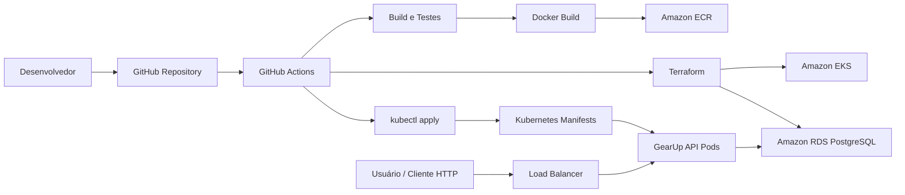

# Arquitetura AWS e Kubernetes

## Visão geral

A arquitetura proposta para a Fase 2 publica a API GearUp em Kubernetes, utilizando AWS como provedor de infraestrutura.

## Componentes

| Componente | Responsabilidade |
|---|---|
| GitHub Actions | Executa CI/CD |
| Amazon ECR | Armazena a imagem Docker da API |
| Amazon EKS | Executa os workloads Kubernetes |
| Kubernetes Deployment | Mantém as réplicas da API em execução |
| Kubernetes Service | Expõe a API dentro/fora do cluster |
| Kubernetes ConfigMap | Guarda configurações não sensíveis |
| Kubernetes Secret | Guarda configurações sensíveis |
| Horizontal Pod Autoscaler | Escala a API conforme CPU/memória |
| Amazon RDS PostgreSQL | Banco de dados relacional |
| Terraform | Provisiona recursos de infraestrutura |

## Desenho lógico



## Fluxo de runtime

1. O usuário acessa a API pelo endereço público do Load Balancer.
2. O Service do Kubernetes encaminha a requisição para os pods da API.
3. A API executa os casos de uso da aplicação.
4. A camada Infrastructure acessa o PostgreSQL no RDS.
5. Configurações sensíveis são lidas via Secrets.
6. Configurações não sensíveis são lidas via ConfigMaps.

## Fluxo de deploy

1. Um push ou merge na branch principal dispara o GitHub Actions.
2. A pipeline compila a aplicação e executa os testes.
3. A pipeline cria a imagem Docker.
4. A imagem é publicada no Amazon ECR.
5. O GitHub Actions se conecta ao cluster EKS.
6. Os manifests Kubernetes são aplicados.
7. O Deployment é atualizado para usar a nova imagem.
8. O rollout é validado.

## Banco de dados

Para ambiente AWS, a recomendação é utilizar **Amazon RDS PostgreSQL**.

Motivos:

- Serviço gerenciado.
- Backup e disponibilidade mais simples.
- Separação entre aplicação e persistência.
- Mais aderente a um ambiente produtivo.

Alternativa para demonstração:

- PostgreSQL em Kubernetes com PersistentVolumeClaim.

Essa alternativa é mais simples, mas menos indicada para produção.

## Escalabilidade

A API deve ter requests e limits definidos no Deployment para permitir o uso do Horizontal Pod Autoscaler.

Exemplo conceitual:

```yaml
resources:
  requests:
    cpu: "100m"
    memory: "128Mi"
  limits:
    cpu: "500m"
    memory: "512Mi"
```

Com isso, o HPA pode escalar os pods conforme o consumo:

```text
minReplicas: 2
maxReplicas: 5
targetCPUUtilizationPercentage: 70
```

## Segurança

Recomendações:

- Não versionar segredos em arquivos YAML.
- Usar GitHub Secrets para credenciais do pipeline.
- Usar Kubernetes Secrets para `Jwt__Key`, connection string e senha do banco.
- Usar IAM Role com OIDC no GitHub Actions, evitando access keys fixas.
- Restringir acesso ao banco apenas ao cluster/aplicação.
