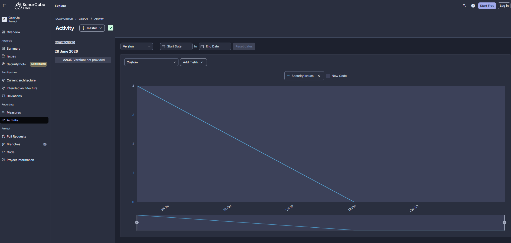
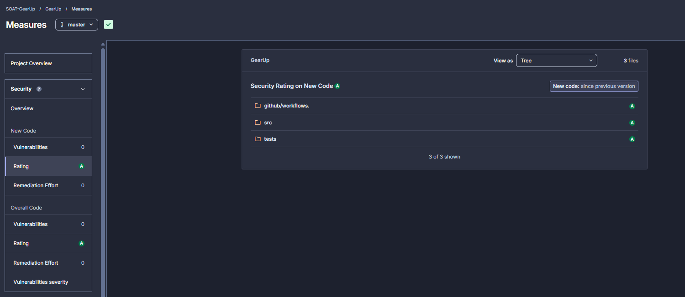
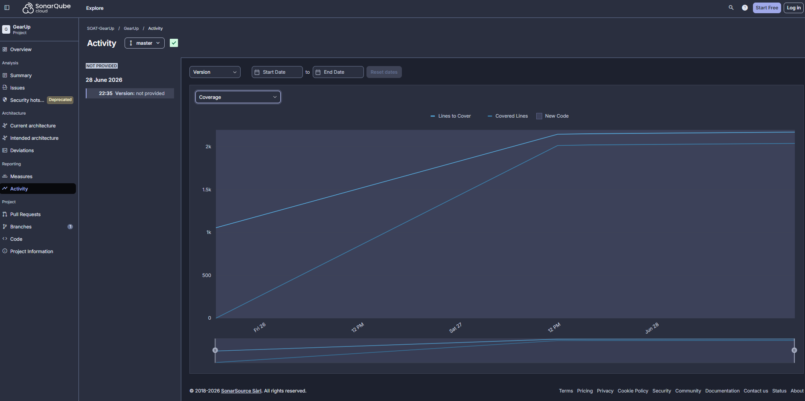
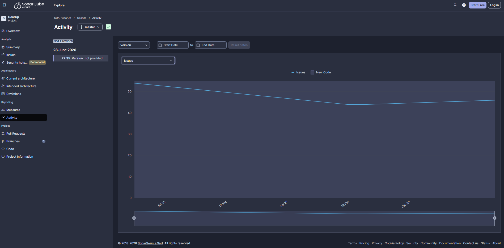

# Relatório de Análise de Vulnerabilidades

> **Projeto:** GearUp  
> **Ferramenta:** SonarCloud / SonarQube Cloud  
> **Data da análise:** 28/06/2026  
> **Branch analisada:** `master`

## Objetivo

Este relatório apresenta o resultado da análise de vulnerabilidades e qualidade de código realizada no projeto **GearUp** por meio do SonarCloud. A análise foi utilizada para identificar riscos de segurança, problemas de manutenção e oportunidades de melhoria na cobertura de testes.

Após a execução da análise inicial, foram realizadas correções no código e ajustes nos testes automatizados, com foco em reduzir vulnerabilidades, melhorar a classificação de segurança e aumentar a confiabilidade da base de código.

---

## 1. Análise de Vulnerabilidades ⭐⭐⭐⭐⭐

### Figura 1 - Security Issues (4 → 0)

A análise inicial identificou **4 Security Issues** no projeto. Após a revisão dos apontamentos do SonarCloud, os problemas foram tratados e a quantidade de issues de segurança foi reduzida para **0**.

Essa evolução demonstra que os pontos classificados como risco de segurança foram analisados e corrigidos, eliminando vulnerabilidades conhecidas detectadas pela ferramenta. A redução para zero também contribui diretamente para a aprovação do Quality Gate e para maior confiança na publicação da aplicação.

### Figura 2 - Security Rating (E → A)

Com a correção das vulnerabilidades, a classificação de segurança evoluiu de **E** para **A**. Essa mudança indica uma melhora significativa no nível de segurança do projeto, saindo da pior classificação para a melhor classificação disponível na ferramenta.

O resultado final apresenta **0 vulnerabilidades** e **Security Rating A** tanto para o código geral quanto para o código novo analisado. Isso evidencia que as alterações aplicadas corrigiram os problemas existentes sem introduzir novos riscos de segurança.

---

## 2. Evolução da Qualidade do Código ⭐⭐⭐⭐

### Figura 3 - Code Coverage

A cobertura de testes evoluiu após a criação e ampliação da suíte automatizada. Foram adicionados testes unitários para as camadas de domínio e aplicação, testes para infraestrutura e testes de integração cobrindo fluxos reais da API.

O histórico mostra crescimento no volume de linhas cobertas, acompanhando a evolução do projeto. Esse aumento é importante porque reduz o risco de regressões e permite validar regras de negócio críticas, como cadastro de clientes, veículos, ordens de serviço, orçamento, estoque e notificações.

### Figura 4 - Code Smells / Maintainability Issues

Além dos pontos de segurança, também foram analisados problemas de manutenção do código, como code smells e issues relacionadas à qualidade.

O histórico indica redução inicial dos problemas apontados pela ferramenta, resultado de ajustes como melhoria na organização dos testes, remoção de práticas inseguras, tratamento de configurações sensíveis e refinamento de implementações sinalizadas pelo SonarCloud.

Embora ainda existam pontos de melhoria, a redução dos problemas de manutenção demonstra evolução na qualidade interna do projeto e cria uma base mais sustentável para futuras entregas.

---

## 3. Principais Ações Realizadas

Durante a análise e correção dos apontamentos, foram realizadas as seguintes ações:

- Remoção de chave JWT sensível do código e da configuração versionada.
- Ajuste da configuração de ambiente para uso seguro da chave JWT em execução local, Docker e testes.
- Correção de alertas apontados pelo SonarCloud nos testes automatizados.
- Inclusão de asserções explícitas em testes para melhorar a clareza e atender às regras de qualidade.
- Criação e ampliação de testes unitários e de integração.
- Organização dos testes conforme os contextos delimitados do projeto.
- Validação de fluxos completos da API com banco PostgreSQL em ambiente de integração.

---

## 4. Resultado Final

Após as correções, o projeto apresentou os seguintes resultados relevantes:

| Métrica | Resultado |
|---|---|
| Security Issues | 4 → 0 |
| Vulnerabilities | 0 |
| Security Rating | E → A |
| Quality Gate | Aprovado |
| Cobertura de testes | Evolução após criação dos testes |
| Code Smells / Issues | Redução de problemas de manutenção |

---

## 5. Conclusão

A análise com SonarCloud foi essencial para identificar vulnerabilidades e pontos de melhoria no projeto GearUp. Após as correções, o projeto passou a apresentar **Security Rating A**, **0 vulnerabilidades** e evolução na cobertura de testes.

Esses resultados reforçam a qualidade técnica da solução e demonstram uma preocupação com segurança, manutenibilidade e confiabilidade do sistema. A continuidade do uso do SonarCloud no pipeline de integração permite acompanhar novas alterações e evitar que vulnerabilidades ou problemas de qualidade sejam reintroduzidos no código.
