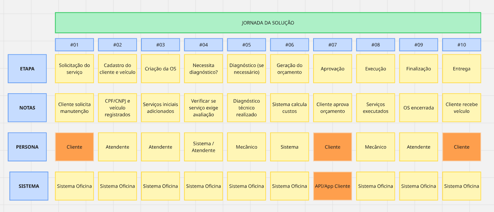

# Documentação de Requisitos

## PERSONA E PROBLEMA

### Personas

As principais personas envolvidas no sistema são:

- **Atendentes:** responsáveis pelo registro dos clientes, abertura das ordens de serviço, validação de orçamentos e comunicação com clientes;
- **Auxiliares:** responsáveis pelo apoio operacional, controle de peças, insumos e suporte aos processos internos;
- **Mecânicos:** responsáveis pelo diagnóstico, execução e atualização dos serviços realizados nos veículos;
- **Clientes:** responsáveis por solicitar serviços, acompanhar o andamento das ordens e aprovar orçamentos e reparos adicionais.

### Problema

Atualmente, a oficina mecânica realiza seus processos de atendimento, diagnóstico, execução de serviços e entrega dos veículos de forma desorganizada, utilizando anotações manuais e planilhas. Esse cenário gera diversos problemas operacionais, tais como:

- Erros na priorização dos atendimentos;
- Falhas no controle de peças e insumos;
- Dificuldade no acompanhamento do status das ordens de serviço;
- Perda do histórico de clientes, veículos e serviços realizados;
- Ineficiência no fluxo de geração, aprovação e atualização de orçamentos;
- Redução da eficiência operacional e dificuldades para expansão do negócio.

Diante desse contexto, existe a necessidade de um sistema integrado capaz de centralizar informações, automatizar processos operacionais e proporcionar maior controle, rastreabilidade e eficiência na gestão da oficina.

## **JORNADA DO PROBLEMA**

A jornada atual da oficina mecânica ocorre de forma predominantemente manual, utilizando anotações físicas, comunicação informal e planilhas, o que gera dificuldades operacionais ao longo do fluxo de atendimento.

### 1. Solicitação do serviço

O cliente chega à oficina solicitando um serviço de manutenção ou reparo. O atendente registra as informações do cliente, veículo e solicitação manualmente, utilizando papel, planilhas ou sistemas desconectados.

**Problemas identificados:**

- Informações podem ser registradas de forma incompleta ou inconsistente;
- Dificuldade em localizar históricos anteriores do cliente ou veículo;
- Dependência excessiva de registros manuais.

### 2. Diagnóstico do veículo

Após o recebimento do veículo, o mecânico realiza o diagnóstico para identificar problemas e definir os serviços necessários.

**Problemas identificados:**

- Informações do diagnóstico ficam dispersas ou não padronizadas;
- Dificuldade em compartilhar informações entre equipe técnica e atendimento;
- Possibilidade de perda de informações importantes.

### 3. Elaboração do orçamento

Com base nos serviços identificados e peças necessárias, o orçamento é montado manualmente e encaminhado ao cliente para aprovação.

**Problemas identificados:**

- Processo lento e sujeito a erros humanos;
- Dificuldade em atualizar orçamentos quando novos problemas são encontrados;
- Fluxo de aprovação pouco rastreável.

### 4. Aprovação e execução do serviço

Após aprovação do orçamento, os serviços são executados e peças utilizadas são retiradas do estoque.

**Problemas identificados:**

- Falta de controle preciso sobre peças e insumos utilizados;
- Dificuldade em visualizar o status atual das ordens de serviço;
- Problemas de priorização entre atendimentos.

### 5. Finalização e entrega do veículo

Após conclusão dos serviços, o cliente é informado e realiza a retirada do veículo.

**Problemas identificados:**

- Histórico dos serviços pode ser perdido;
- Falta de visibilidade para o cliente durante o processo;
- Dificuldade em medir tempo de execução e produtividade.

### Consequências do cenário atual

O processo atual gera baixa eficiência operacional, reduz a rastreabilidade das informações e dificulta a escalabilidade da oficina, impactando diretamente a qualidade do atendimento, a produtividade da equipe e a experiência dos clientes.

## Objetivo da Solução

Desenvolver uma plataforma integrada para centralizar as informações relacionadas a clientes, veículos, ordens de serviço, diagnósticos, peças e execução dos reparos, garantindo maior organização, rastreabilidade e eficiência operacional nos processos da oficina.

A solução busca:

- Centralizar informações de clientes, veículos, serviços, peças e ordens de serviço em um único sistema;
- Garantir que os dados sejam registrados de forma padronizada, consistente e rastreável;
- Melhorar o processo de diagnóstico e acompanhamento da execução dos serviços;
- Tornar o fluxo de orçamento, aprovação e execução mais eficiente e transparente;
- Melhorar o controle de estoque de peças e insumos;
- Permitir o acompanhamento do histórico de clientes, veículos e serviços realizados;
- Fornecer métricas que auxiliem na estimativa de tempo, produtividade e desempenho operacional;
- Permitir que clientes acompanhem o andamento das ordens de serviço e aprovem reparos adicionais.

### Objetivos mensuráveis

- Reduzir o tempo necessário para gerenciamento e acompanhamento das ordens de serviço;
- Melhorar a precisão do controle de estoque e reduzir inconsistências de inventário;
- Reduzir retrabalho causado por perda ou inconsistência de informações;
- Melhorar a previsibilidade do tempo de execução dos serviços através do uso de dados históricos.

## JORNADA DA SOLUÇÃO

# REQUISITOS DA SOLUÇÃO

### Requisitos Funcionais

#### Autenticação e acesso

**RF01.** O sistema deve permitir que usuários autenticados realizem login utilizando usuário e senha.

**RF02.** O sistema deve permitir logout do usuário autenticado.

**RF03.** O sistema deve controlar permissões de acesso conforme o perfil do usuário (atendente, auxiliar, mecânico e cliente).

### Clientes e veículos

**RF04.** O sistema deve permitir cadastrar, editar e consultar clientes.

**RF05.** O sistema deve permitir cadastrar, editar e consultar veículos vinculados aos clientes.

**RF06.** O sistema deve manter histórico de serviços realizados por cliente e veículo.

### Ordem de serviço

**RF07.** O sistema deve permitir criar ordens de serviço contendo informações do cliente, veículo e solicitação inicial.

**RF08.** O sistema deve permitir atualizar o status da ordem de serviço durante sua execução.

Status:

- Recebida
- Em diagnóstico
- Aguardando orçamento
- Aguardando aprovação
- Cancelada
- Aguardando Peças e Insumos
- Aguardando Execução
- Em execução
- Finalizada
- Entregue

RF09. O sistema deve permitir definir prioridades para ordens de serviço utilizando critérios como urgência, prazo ou ordem de chegada.

**RF10.** O sistema deve permitir consultar ordens de serviço em andamento.

### Diagnóstico e orçamento

**RF11.** O sistema deve permitir registrar diagnósticos realizados pelos mecânicos.

**RF12.** O sistema deve permitir gerar orçamentos vinculados às ordens de serviço.

**RF13.** O sistema deve permitir adicionar, editar e remover itens do orçamento.

**RF14.** O sistema deve permitir registrar peças, mão de obra e serviços no orçamento.

**RF15.** O sistema deve permitir criar novos orçamentos quando novos problemas forem identificados.

**RF16.** O sistema deve permitir registrar aprovação ou rejeição do orçamento pelo cliente.

### Estoque

**RF17.** O sistema deve permitir registrar entrada e saída de peças e insumos.

**RF18.** O sistema deve atualizar automaticamente o estoque quando peças forem utilizadas em ordens de serviço.

### Notificações

**RF19.** O sistema deve notificar o cliente quando ocorrer alteração relevante na ordem de serviço.

Exemplos:

- orçamento disponível
- orçamento aprovado/rejeitado
- serviço iniciado
- serviço finalizado

**RF20.** O sistema deve notificar atendentes quando houver ações pendentes relacionadas às ordens de serviço.

### Acompanhamento

**RF21.** O sistema deve permitir que clientes acompanhem o andamento das ordens de serviço.

**RF22.** O sistema deve permitir consultar histórico completo de ordens de serviço.

### Requisitos Não Funcionais

#### Disponibilidade

**RNF01.** O sistema deve possuir disponibilidade mínima de 99,5% mensal.

#### Performance

**RNF02.** O tempo médio de resposta das APIs deve ser inferior a 1 segundo para 95% das requisições em condições normais de operação.

### Segurança

**RNF03.** O sistema deve armazenar senhas utilizando algoritmos de hash seguros.

**RNF04.** O sistema deve utilizar comunicação criptografada via HTTPS.

#### LGPD

**RNF05.** O sistema deve permitir armazenamento, tratamento e exclusão de dados pessoais conforme exigências da legislação vigente de proteção de dados.

### Auditoria / rastreabilidade

**RNF06.** O sistema deve registrar histórico de alterações realizadas em ordens de serviço, orçamentos e estoque.

### Escalabilidade

**RNF07.** O sistema deve suportar múltiplos usuários simultâneos sem degradação perceptível da experiência.