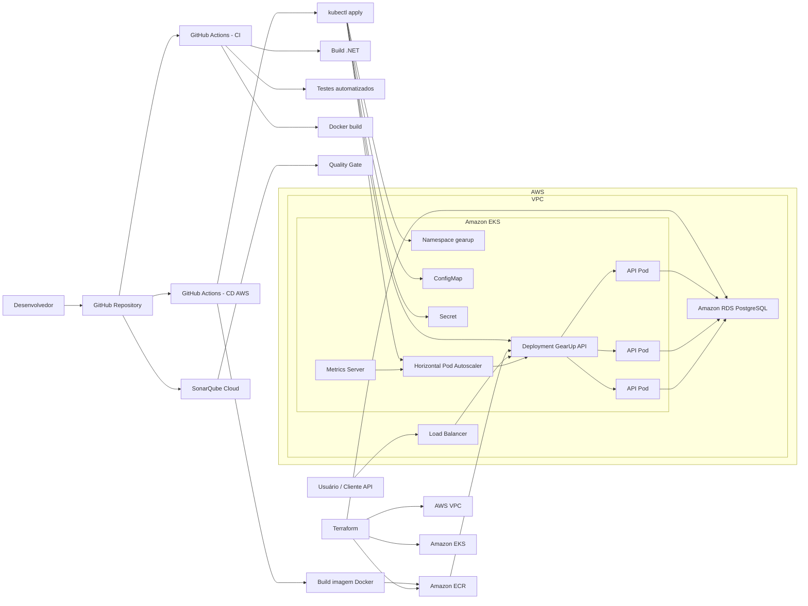

# Arquitetura da Solução - Fase 2

## Objetivo

Representar a arquitetura cloud native adotada na Fase 2 do GearUp, incluindo aplicação, pipeline CI/CD, infraestrutura AWS, Kubernetes, banco de dados e escalabilidade horizontal.

## Diagrama

## Componentes

| Componente | Responsabilidade |
|---|---|
| GitHub Repository | Armazena código-fonte, documentação, manifests Kubernetes, Terraform e workflows |
| GitHub Actions - CI | Executa restore, build, testes, valida cobertura e build da imagem Docker |
| SonarQube Cloud | Analisa qualidade, segurança e cobertura do código |
| GitHub Actions - CD AWS | Publica imagem no ECR e aplica manifests no EKS |
| Amazon ECR | Registry das imagens Docker da API |
| Terraform | Provisiona VPC, EKS, ECR, RDS e recursos de rede |
| Amazon EKS | Cluster Kubernetes que executa a API |
| Load Balancer | Expõe a API para acesso externo |
| ConfigMap | Armazena configurações não sensíveis |
| Secret | Armazena configurações sensíveis, como JWT e connection string |
| Deployment | Controla a execução dos pods da GearUp API |
| HPA | Escala horizontalmente os pods da API conforme CPU e memória |
| Metrics Server | Fornece métricas para o HPA |
| Amazon RDS PostgreSQL | Banco de dados gerenciado usado pela aplicação |

## Fluxo de Deploy

1. O desenvolvedor envia alterações para o GitHub.
2. O workflow de CI executa build, testes e validações.
3. O workflow de CD cria a imagem Docker e publica no Amazon ECR.
4. O GitHub Actions configura acesso ao EKS.
5. Os manifests Kubernetes são aplicados no cluster.
6. O deployment da API passa a usar a nova imagem publicada.
7. A API executa migrations no startup e conecta ao RDS PostgreSQL.
8. As probes de readiness e liveness validam se a aplicação está pronta.
9. O HPA usa métricas do Metrics Server para ajustar a quantidade de réplicas.

## Escalabilidade

O HPA foi configurado para escalar o deployment `gearup-api` entre 1 e 3 réplicas, usando:

- CPU: 70%;
- memória: 80%.

Durante a validação em AWS, a aplicação escalou automaticamente para 3 réplicas quando a métrica de memória ficou acima do alvo configurado.
