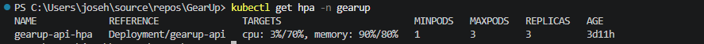
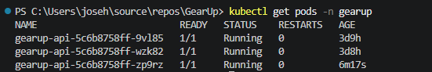
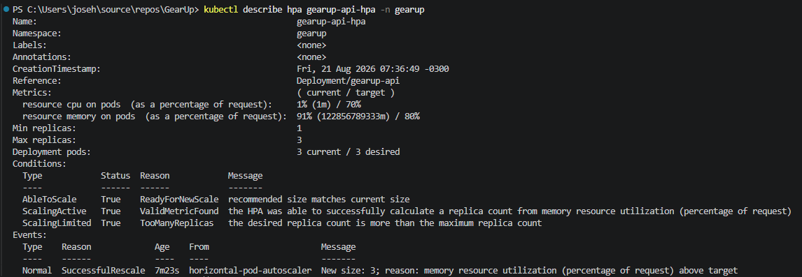
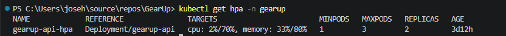
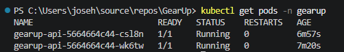

# Deploy AWS com EKS

## Objetivo

Executar a API GearUp em um cluster Kubernetes na AWS, usando EKS para orquestração, ECR para armazenamento da imagem Docker e RDS PostgreSQL como banco de dados.

## Estrutura

Os manifests da AWS ficam em:

```text
k8s/aws/
├── namespace.yaml
├── configmap.yaml
├── secret.example.yaml
├── api-deployment.yaml
├── api-service.yaml
└── hpa.yaml
```

Diferente do ambiente local, a versão AWS não cria PostgreSQL dentro do cluster. A aplicação deve acessar um banco externo, preferencialmente RDS PostgreSQL.

## Componentes

| Manifest | Função |
|---|---|
| `namespace.yaml` | Cria o namespace `gearup` |
| `configmap.yaml` | Define configurações não sensíveis |
| `secret.example.yaml` | Exemplo de secrets esperados |
| `api-deployment.yaml` | Executa a API GearUp no cluster |
| `api-service.yaml` | Expõe a API por Load Balancer |
| `hpa.yaml` | Configura escalabilidade horizontal |

## Imagem Docker

O deployment AWS usa imagem do ECR:

```yaml
image: 469257649079.dkr.ecr.us-east-1.amazonaws.com/gearup:latest
```

Na pipeline CI/CD, a recomendação é substituir `latest` por uma tag versionada, preferencialmente o SHA do commit.

Exemplo:

```yaml
image: 469257649079.dkr.ecr.us-east-1.amazonaws.com/gearup:<commit-sha>
```

## Secret

Crie o secret real a partir do exemplo:

```powershell
Copy-Item .\k8s\aws\secret.example.yaml .\k8s\aws\secret.local.yaml
```

Depois ajuste:

- `Jwt__Key`;
- `Seed__AdminPassword`;
- `ConnectionStrings__GearUpDatabase`.

O arquivo real com secrets não deve ser versionado.

## Aplicar manifests

Com o `kubectl` apontando para o cluster EKS:

```powershell
kubectl apply -f .\k8s\aws\namespace.yaml
kubectl apply -f .\k8s\aws\configmap.yaml
kubectl apply -f .\k8s\aws\secret.local.yaml
kubectl apply -f .\k8s\aws\api-deployment.yaml
kubectl apply -f .\k8s\aws\api-service.yaml
kubectl apply -f .\k8s\aws\hpa.yaml
```

## Verificar execução

```powershell
kubectl get pods -n gearup
kubectl get svc -n gearup
kubectl get hpa -n gearup
```

Para obter o endereço público criado pelo Load Balancer:

```powershell
kubectl get svc gearup-api -n gearup
```

## Health checks

A API expõe endpoints de health check usados pelas probes do Kubernetes:

- `/health/live`: usado pela liveness probe para verificar se o processo da API está em execução;
- `/health/ready`: usado pela readiness probe para verificar se a API está pronta para receber tráfego e se consegue conectar ao PostgreSQL/RDS.

A API possui probes de liveness e readiness; o Kubernetes só envia tráfego quando a aplicação está pronta.

Depois de publicar uma nova imagem com alterações de código, atualize a tag no `api-deployment.yaml` e aplique novamente o deployment.

## HPA e Metrics Server

O manifesto `hpa.yaml` configura escalabilidade horizontal para o deployment `gearup-api`:

```yaml
minReplicas: 1
maxReplicas: 3
```

Métricas configuradas:

- CPU: alvo de 70% da request configurada no pod;
- memória: alvo de 80% da request configurada no pod.

No deployment AWS, a API usa `memory request` de `256Mi`, valor mais adequado para a execução de uma API .NET no cenário validado.

Para o HPA conseguir ler CPU e memória no EKS, o Metrics Server precisa estar instalado no cluster. Sem ele, os comandos `kubectl top` falham e o HPA exibe `<unknown>` nas métricas.

Instalação usada na validação:

```powershell
kubectl apply -f https://github.com/kubernetes-sigs/metrics-server/releases/latest/download/components.yaml
```

Validação das métricas:

```powershell
kubectl top nodes
kubectl top pods -n gearup
kubectl get hpa -n gearup
```

Resultado observado após instalação do Metrics Server e ajuste para `maxReplicas: 3`:

```text
NAME             REFERENCE               TARGETS                        MINPODS   MAXPODS   REPLICAS
gearup-api-hpa   Deployment/gearup-api   cpu: 3%/70%, memory: 90%/80%   1         3         3
```

Figura 1 - HPA com métricas reais e limite máximo de 3 réplicas:



Para gerar carga durante a validação, foi usado um pod temporário:

```powershell
kubectl run load-generator `
  --rm -i --tty `
  --image=busybox `
  --restart=Never `
  --namespace gearup `
  -- /bin/sh
```

Dentro do shell do pod:

```sh
while true; do wget -q -O- http://gearup-api/health/live; done
```

Para acompanhar o HPA e os pods durante a escala automática:

```powershell
kubectl get hpa -n gearup -w
kubectl get pods -n gearup -w
```

Pods da API após a escala para 3 réplicas:

```text
gearup-api-5c6b8758ff-9vl85   1/1   Running
gearup-api-5c6b8758ff-wzk82   1/1   Running
gearup-api-5c6b8758ff-zp9rz   1/1   Running
```

Figura 2 - Deployment da API com 3 pods em execução:



Evento registrado pelo HPA:

```text
SuccessfulRescale - New size: 3; reason: memory resource utilization above target
```

Figura 3 - Evento de escala automática registrado pelo HPA:



Após a validação, o pod de carga foi removido:

```powershell
kubectl delete pod load-generator -n gearup
```

Com a carga reduzida e após a janela de estabilização do HPA, a utilização caiu e o Kubernetes iniciou a redução gradual de réplicas:

```text
gearup-api-hpa   Deployment/gearup-api   cpu: 2%/70%, memory: 33%/80%   1         3         2
```

Figura 4 - HPA após redução de consumo, mantendo 2 réplicas:



Figura 5 - Pods da API após redução para 2 réplicas:



## Observações

Os nodes do EKS precisam ter permissão para baixar imagens do ECR. Essa permissão pode ser atendida por uma role com acesso de leitura ao ECR.

O banco RDS precisa aceitar conexão a partir da rede usada pelo cluster EKS, respeitando VPC, subnets, security groups e regras de entrada.
