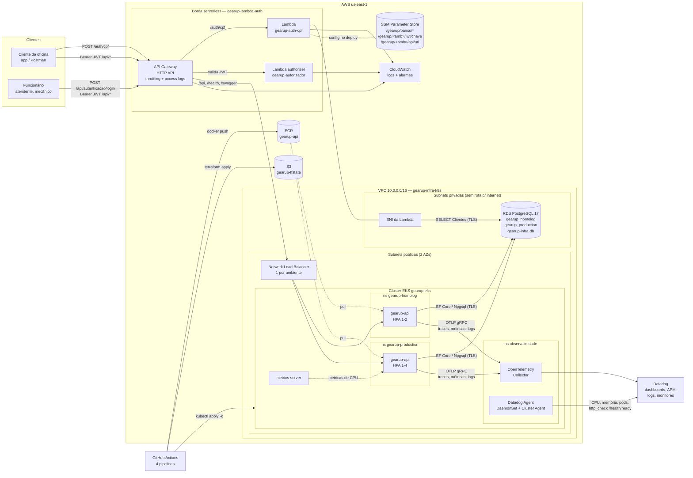
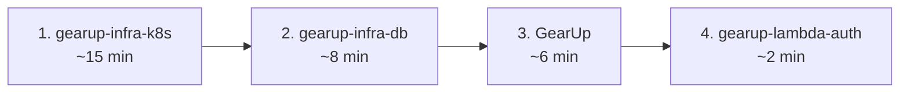

# Arquitetura da Solução — Fase 3

## Visão geral

Na Fase 3 o GearUp deixa de ser um único repositório com "tudo junto" e passa a ser uma plataforma em **quatro repositórios**, cada um com seu próprio ciclo de vida e pipeline:

| Repositório | Responsabilidade | Pipeline |
|---|---|---|
| [GearUp](https://github.com/SOAT-GearUp/GearUp) | API .NET 10 (DDD + Clean Architecture), manifests Kubernetes, documentação | CI em todo push/PR; CD em `homolog` e `master` |
| [gearup-infra-k8s](https://github.com/SOAT-GearUp/gearup-infra-k8s) | VPC, EKS, ECR, OpenTelemetry Collector, Datadog Agent, dashboards e monitores | plan em PR/`homolog`; apply em `main` |
| [gearup-infra-db](https://github.com/SOAT-GearUp/gearup-infra-db) | RDS PostgreSQL gerenciado + credenciais no SSM | plan em PR/`homolog`; apply em `main` |
| [gearup-lambda-auth](https://github.com/SOAT-GearUp/gearup-lambda-auth) | Lambda de autenticação por CPF, Lambda authorizer e API Gateway | deploy por ambiente em `homolog` e `main` |

Tudo roda em **AWS (us-east-1)**, dentro do AWS Academy Learner Lab. As decisões que moldam a arquitetura — orçamento fixo de US$ 50, proibição de criar IAM, ausência de NAT Gateway — estão registradas nas [RFCs](../RFC) e [ADRs](../ADR).

## Diagrama de componentes

## Como as peças se encontram

Os repositórios **não leem o state do Terraform uns dos outros**. Cada dependência é resolvida por um contrato explícito e barato:

| Quem publica | O quê | Como é encontrado | Quem consome |
|---|---|---|---|
| gearup-infra-k8s | VPC e subnets | tags `Name=gearup-vpc` e `Camada=publica/privada` | infra-db, lambda-auth |
| gearup-infra-k8s | cluster `gearup-eks`, ECR `gearup-api`, Collector | nomes fixos | GearUp (CD) |
| gearup-infra-db | host, porta, usuário e senha do RDS | SSM `/gearup/banco/*` | GearUp (CD), lambda-auth |
| GearUp (CD) | chave JWT e senha do admin, por ambiente | SSM `/gearup/<amb>/jwt/chave`, `/gearup/<amb>/api/senha-admin` | lambda-auth |
| GearUp (CD) | URL do NLB da API | SSM `/gearup/<amb>/api/url` | lambda-auth (integração do gateway) |
| gearup-lambda-auth | URL pública do gateway | SSM `/gearup/<amb>/gateway/url` | GearUp (resumo do deploy), documentação |

Detalhes e alternativas descartadas em [ADR-004](../ADR/ADR-004%20-%20Repositorios%20separados%20e%20contratos%20via%20SSM.md).

## Ordem de deploy (primeira vez)

O destroy segue a ordem inversa (lambda → GearUp → db → k8s). O passo a passo completo, incluindo a atualização das credenciais do lab, está no [Guia de Operação](../Operacao/Guia%20de%20Deploy%20e%20Operacao.md).

## Ambientes

| | homolog | production |
|---|---|---|
| Branch que dispara o deploy | `homolog` | `master` (GearUp) / `main` (demais) |
| Namespace Kubernetes | `gearup-homolog` | `gearup-production` |
| Database no RDS | `gearup_homolog` | `gearup_production` |
| API Gateway + Lambdas | pilha própria | pilha própria |
| HPA | 1–2 réplicas | 1–4 réplicas |
| Swagger | habilitado | desabilitado |
| Cluster EKS e instância RDS | compartilhados | compartilhados |

Compartilhar cluster e instância RDS entre ambientes é uma decisão de custo documentada na [RFC-001](../RFC/RFC-001%20-%20Nuvem%20e%20estrategia%20de%20ambientes.md).

## Segurança

- **Borda única:** nenhum cliente fala direto com o cluster. O API Gateway aplica throttling (20 req/s, rajada 40) e o authorizer barra `/api/*` sem JWT válido antes de o tráfego chegar ao EKS.
- **Defesa em profundidade:** a API valida o JWT de novo (assinatura, issuer, audience, expiração) e aplica autorização por perfil (`[Authorize(Roles = ...)]`) e por dono da OS (`PodeAcessarOrdemServico`).
- **Banco isolado:** RDS em subnets privadas sem rota para a internet, `publicly_accessible = false`, TLS obrigatório (`rds.force_ssl = 1`).
- **Segredos fora do Git:** senha do banco gerada pelo Terraform (`random_password`), chave JWT gerada pela pipeline; ambos em SSM SecureString. Os únicos GitHub Secrets são as credenciais temporárias do lab (e, opcionalmente, as chaves do Datadog).
- **LGPD:** a Lambda nunca registra o CPF completo nos logs (`***.982.247-**`).
- **Contêiner:** `runAsNonRoot`, `allowPrivilegeEscalation: false`, capabilities removidas, sem token de service account montado.

## Custos estimados (Learner Lab)

| Recurso | US$/hora | Observação |
|---|---|---|
| EKS control plane | 0,100 | cobra 24/7, inclusive com o lab parado |
| 2 × EC2 t3.medium (nós) | 0,083 | o lab religa as instâncias a cada sessão |
| 2 × NLB (homolog + production) | 0,045 | criados pelo Service `LoadBalancer` |
| RDS db.t3.micro + 20 GB gp3 | 0,021 | cobra 24/7 |
| API Gateway, Lambda, SSM, S3, CloudWatch | ~0 | pay-per-use, dentro do free tier |
| **Total** | **~0,25/h ≈ US$ 6/dia** | **destroy ao fim de cada sessão** |

Sem NAT Gateway (economia de US$ 0,045/h + tráfego): ver [ADR-005](../ADR/ADR-005%20-%20Rede%20sem%20NAT%20Gateway.md).
