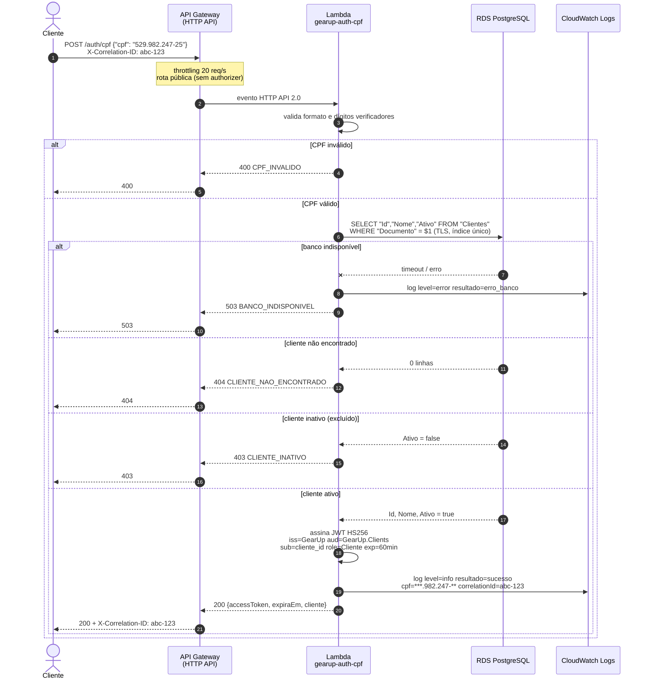
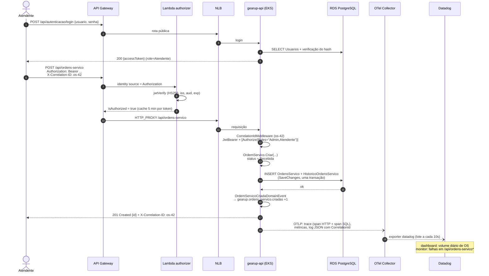
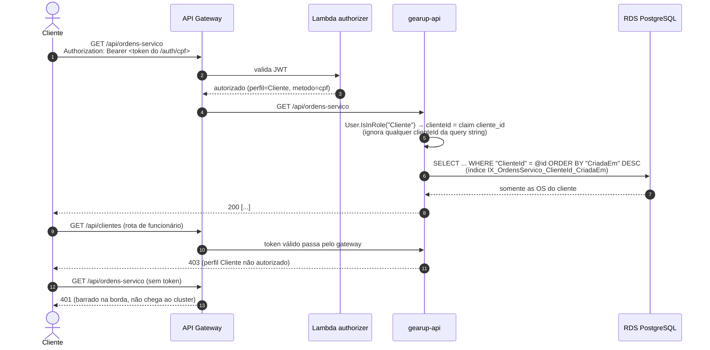

# Diagramas de Sequência

## 1. Autenticação do cliente por CPF

O cliente informa apenas o CPF. A Lambda valida o documento, confirma que o cliente existe e está ativo na base e devolve um JWT no mesmo formato do login de funcionários.

## 2. Abertura de ordem de serviço (funcionário)

A OS é aberta por um atendente autenticado. O fluxo mostra a dupla validação do token (gateway e API), a persistência transacional e a emissão de telemetria.

## 3. Cliente consultando as próprias ordens

A aceitação do token da Lambda pela API é garantida pelos testes de contrato em `tests/GearUp.Api.IntegrationTests/Autenticacao/TokenLambdaCpfTests.cs`.
