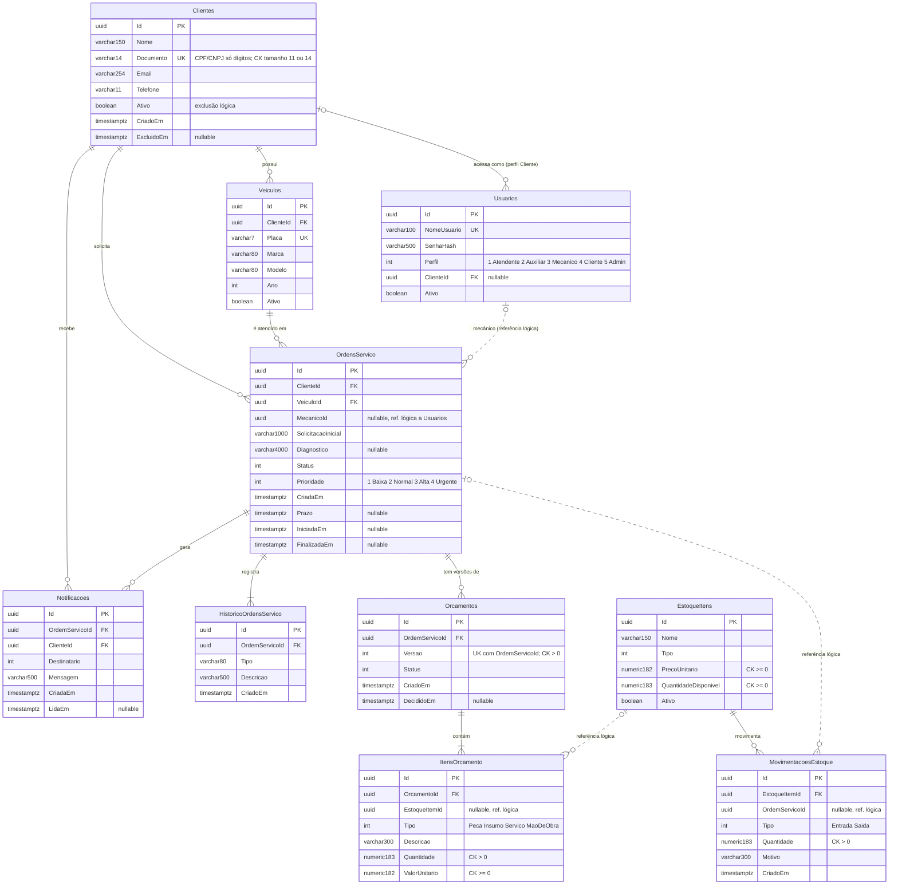

# Banco de Dados — Justificativa e Modelagem Relacional

## 1. Escolha do banco

**PostgreSQL 17 no Amazon RDS** (repositório [gearup-infra-db](https://github.com/SOAT-GearUp/gearup-infra-db)). A comparação completa com Aurora, MySQL, SQL Server, DynamoDB e PostgreSQL no cluster está na [RFC-002](../RFC/RFC-002%20-%20Banco%20de%20dados%20gerenciado.md). Em resumo:

- **O domínio é relacional.** Uma OS pertence a um cliente e a um veículo, tem histórico, orçamentos versionados e itens que consomem estoque. As consultas centrais são joins e ordenações filtradas.
- **Consistência transacional.** Criar uma OS grava a OS e o primeiro evento do histórico no mesmo `SaveChanges`; aprovar um orçamento muda orçamento e OS juntos. PostgreSQL garante ACID e integridade referencial.
- **Tipos nativos que o modelo já usa:** `uuid` para chaves geradas no domínio, `timestamp with time zone` para todos os instantes (`DateTimeOffset`), `numeric(18,2)`/`numeric(18,3)` para dinheiro e quantidades — sem erro de ponto flutuante.
- **Gerenciado:** backups automáticos com point-in-time recovery, patches de minor version, criptografia em repouso e TLS obrigatório, sem operar StatefulSet e volumes.
- **Custo:** db.t3.micro é a menor instância que atende; o mesmo schema roda local em Docker (`postgres:18-alpine`) e nos testes de integração (Testcontainers `postgres:16`).

## 2. Diagrama ER

Linhas contínuas são chaves estrangeiras; linhas tracejadas são **referências lógicas** (id guardado sem FK), explicadas na seção 4.

## 3. Relacionamentos

| Relacionamento | Cardinalidade | Regra de exclusão | Por quê |
|---|---|---|---|
| Cliente → Veículos | 1:N | `CASCADE` | o veículo não existe sem o dono; na prática o cliente é excluído logicamente (`Ativo = false`), então o cascade só age em limpeza administrativa |
| Cliente → Ordens de serviço | 1:N | `RESTRICT` | OS é registro fiscal/histórico: não pode sumir porque um cliente foi removido |
| Veículo → Ordens de serviço | 1:N | `RESTRICT` | idem |
| Cliente → Usuários | 1:N (0..1 por usuário) | `RESTRICT` | só usuários de perfil `Cliente` têm `ClienteId` (invariante do agregado `Usuario`) |
| Cliente → Notificações | 1:N | `RESTRICT` | **nova na Fase 3** — antes `ClienteId` não tinha FK e aceitava ids órfãos |
| OS → Histórico | 1:N (≥ 1) | `CASCADE` | parte do agregado `OrdemServico`; toda OS nasce com o evento `OS_CRIADA` |
| OS → Orçamentos | 1:N | `CASCADE` | versões de orçamento de uma OS; `(OrdemServicoId, Versao)` é único |
| Orçamento → Itens | 1:N (≥ 1) | `CASCADE` | parte do agregado `Orcamento` |
| OS → Notificações | 1:N | `CASCADE` | notificação só faz sentido com a OS |
| Estoque → Movimentações | 1:N | `CASCADE` | parte do agregado `Estoque` |

Os agregados do DDD definem as fronteiras: entidades internas (histórico, itens, movimentações) são gravadas e apagadas pelo agregado raiz, por isso usam `CASCADE`; relações **entre agregados** usam `RESTRICT`.

## 4. Ajustes no modelo relacional (Fase 3)

Migration `20260930003943_Fase3ConsistenciaEPerformance`, aplicada automaticamente pela API ao subir (`DatabaseInitializer` → `MigrateAsync`). Cobertura: `tests/GearUp.Infrastructure.UnitTests/Persistence/ModeloRelacionalTests.cs` e os testes de integração (que rodam as migrations num PostgreSQL real).

### 4.1 Consistência — check constraints

As regras já existiam no domínio; agora o banco também as garante, protegendo contra scripts manuais, bugs futuros e escrita concorrente.

| Constraint | Regra | Invariante de domínio correspondente |
|---|---|---|
| `CK_Clientes_Documento_Tamanho` | `char_length("Documento") IN (11, 14)` | `Documento.Criar` aceita só CPF (11) ou CNPJ (14) |
| `CK_EstoqueItens_QuantidadeDisponivel` | `>= 0` | `Estoque.Movimentar` recusa saída acima do saldo |
| `CK_EstoqueItens_PrecoUnitario` | `>= 0` | preço não pode ser negativo |
| `CK_MovimentacoesEstoque_Quantidade` | `> 0` | quantidade deve ser maior que zero |
| `CK_ItensOrcamento_Quantidade` | `> 0` | `ItemOrcamento` valida quantidade |
| `CK_ItensOrcamento_ValorUnitario` | `>= 0` | idem para valor |
| `CK_Orcamentos_Versao` | `> 0` | versões começam em 1 |

O saldo de estoque é o caso mais importante: duas baixas concorrentes podem passar pela validação em memória do agregado; o check garante que o `UPDATE` da segunda falhe em vez de deixar saldo negativo.

### 4.2 Integridade — nova chave estrangeira

`FK_Notificacoes_Clientes_ClienteId` (`RESTRICT`): a coluna era gravada em toda notificação, mas não havia FK. Toda `Notificacao.Criar` recebe o id de um cliente real (o da OS), então a restrição não muda comportamento — só impede dados órfãos.

### 4.3 Performance — índices

| Índice | Consulta atendida |
|---|---|
| `IX_OrdensServico_ClienteId_CriadaEm` (`CriadaEm DESC`) | `GET /api/ordens-servico` do cliente autenticado por CPF, mais recentes primeiro. **Substitui** `IX_OrdensServico_ClienteId` (mesmo prefixo, continua servindo à FK) |
| `IX_OrdensServico_MecanicoId` | OS atribuídas a um mecânico |
| `IX_HistoricoOrdensServico_OrdemServicoId_CriadoEm` | linha do tempo de uma OS em ordem cronológica, base do tempo por status. **Substitui** o índice simples da FK |
| `IX_Notificacoes_ClienteId_CriadaEm` | notificações de um cliente |
| `IX_MovimentacoesEstoque_OrdemServicoId` | peças consumidas por uma OS |
| `IX_ItensOrcamento_EstoqueItemId` | orçamentos que usam um item de estoque |

Índices já existentes e mantidos: `UX_Clientes_Documento` (autenticação por CPF — um *index scan* de uma linha na Lambda), `IX_OrdensServico_Status_Prioridade_CriadaEm` (fila da oficina ordenada por status e prioridade), `IX_Veiculos_Placa` (único), `IX_Usuarios_NomeUsuario` (único, login), `IX_Orcamentos_OrdemServicoId_Versao` (único).

### 4.4 Referências lógicas (sem FK) — decisão consciente

`MovimentacoesEstoque.OrdemServicoId`, `ItensOrcamento.EstoqueItemId` e `OrdensServico.MecanicoId` cruzam **bounded contexts** (Estoque × Execução, Diagnóstico & Orçamento × Estoque, Execução × Autenticação). Manter só o id, sem FK, preserva a independência dos contextos: o Estoque pode registrar histórico mesmo que uma OS seja arquivada, e o contexto de Estoque pode, no futuro, virar um serviço com banco próprio sem migração de constraints. Os índices da seção 4.3 garantem a performance das consultas.

## 5. Parâmetros do servidor

Definidos no parameter group do `gearup-infra-db`:

| Parâmetro | Valor | Motivo |
|---|---|---|
| `rds.force_ssl` | 1 | conexões sem TLS são recusadas |
| `log_min_duration_statement` | 500 ms | registra consultas lentas — ponto de partida para novos índices |
| `idle_in_transaction_session_timeout` | 60 s | evita locks presos por transações esquecidas |
| `shared_preload_libraries` | `pg_stat_statements` | estatísticas por consulta para análise de gargalos |

## 6. Isolamento por ambiente

Uma instância, dois databases: `gearup_homolog` e `gearup_production`. Cada ambiente tem sua connection string (montada pela pipeline a partir do SSM) e sua própria Lambda apontando para o database correspondente. Trade-off de custo em [RFC-001](../RFC/RFC-001%20-%20Nuvem%20e%20estrategia%20de%20ambientes.md).
