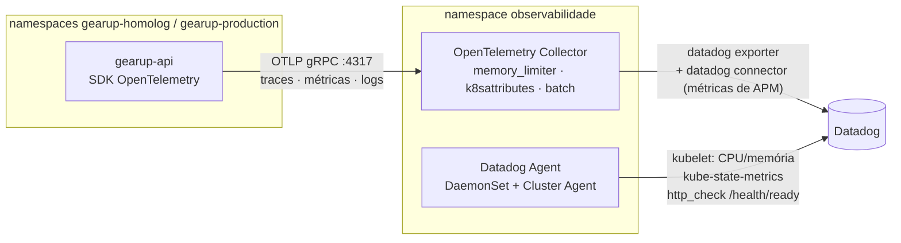

# Dashboards e Alertas

Tudo é versionado como código em [gearup-infra-k8s/datadog](https://github.com/SOAT-GearUp/gearup-infra-k8s/tree/main/datadog) e aplicado pela pipeline em push na `main` quando os secrets `DATADOG_API_KEY` e `DATADOG_APP_KEY` existem.

## Fluxo da telemetria no EKS



## Dashboard "GearUp - Operação"

Template `$env` alterna entre `homolog` e `production`.

| Grupo | Widgets | Requisito atendido |
|---|---|---|
| Resumo | OS criadas, erros e requisições nas últimas 24 h; status do `http_check`; lista de monitores | visão geral |
| 1. Volume de OS | OS criadas por dia (`rollup(sum, 86400)`); transições por status de destino | **volume diário de OS** |
| 2. Tempo por status | média de `gearup.ordens_servico.tempo_status` por status anterior (Recebida, EmDiagnostico, EmExecucao, ...) | **tempo médio por status** |
| 3. Erros e integrações | `gearup.api.erros` por rota e código; respostas 5xx por rota | **erros e falhas nas integrações** |
| 4. Latência | p95 por rota, p50 geral, requisições por status HTTP | **latência das APIs** |
| 5. Kubernetes | CPU e memória por pod, réplicas disponíveis (HPA) | **consumo de recursos** |
| 6. Healthchecks | tempo de resposta do `/health/ready` | **healthchecks e uptime** |
| 7. Logs | stream de logs `status:error` com `CorrelationId` e `trace_id` | **logs estruturados com correlação** |

## Monitores

| Monitor | Condição | Por quê |
|---|---|---|
| Falhas no processamento de OS | > 5 erros em `api/ordens-servico*` em 5 min (aviso ≥ 1) | **alerta exigido** |
| Erro não tratado na API | qualquer log `status:error` em 5 min | exceções que viraram 500 |
| Latência p95 > 1 s | 10 min (aviso 0,5 s) | degradação percebida pelo cliente |
| CPU > 80% do limite | 10 min, por pod | HPA no teto ou pod travado |
| Memória > 85% do limite | 10 min, por pod | risco de OOMKill |
| Pods reiniciando | > 2 restarts em 10 min | crash loop |
| Healthcheck falhando | 3 falhas seguidas do `http_check` | **uptime** |

A variável `destino_notificacao` (ex.: `@time@exemplo.com`) liga o envio de e-mail; vazia, os alertas aparecem só no painel.

## Camada serverless (CloudWatch)

A Lambda de autenticação roda em subnet privada sem NAT e não alcança o Datadog ([ADR-005](../ADR/ADR-005%20-%20Rede%20sem%20NAT%20Gateway.md)). Alarmes criados pelo `gearup-lambda-auth`:

| Alarme | Métrica |
|---|---|
| `gearup-auth-cpf-<amb>-erros` | `AWS/Lambda Errors` ≥ 3 em 5 min |
| `gearup-auth-cpf-<amb>-latencia` | `AWS/Lambda Duration` p95 > 2 s |
| `gearup-api-<amb>-5xx` | `AWS/ApiGateway 5xx` ≥ 5 em 5 min |
| `gearup-auth-cpf-<amb>-falhas-banco` | métrica de log `resultado = "erro_banco"` |

## Logs estruturados e correlação

- **API:** `AddJsonConsole` (stdout) + exporter OTLP de logs. Cada linha traz `TraceId`, `SpanId` e o escopo `CorrelationId`.
- **Lambda:** uma linha JSON por evento (`correlationId`, `resultado`, `clienteId`, `duracaoMs`, CPF mascarado).
- **Gateway:** access log JSON com `requestId`, rota, status, latência total e da integração.
- O `X-Correlation-ID` enviado pelo cliente atravessa gateway → Lambda/API e volta na resposta. Buscar `@CorrelationId:<valor>` no Datadog ou `correlationId = "<valor>"` no CloudWatch Logs Insights reconstrói a requisição.

### Consultas úteis

```text
# Datadog Log Explorer — uma requisição de ponta a ponta
service:gearup-api @CorrelationId:postman-1234

# CloudWatch Logs Insights — resultados da autenticação na última hora
fields @timestamp, resultado, cpf, correlationId, duracaoMs
| filter ispresent(resultado)
| stats count() by resultado
```

## Rodar sem Datadog

Sem `DATADOG_API_KEY`, o Collector sobe com o exporter `debug`: a telemetria aparece em

```powershell
kubectl logs -n observabilidade deploy/otel-collector --tail=50
```
