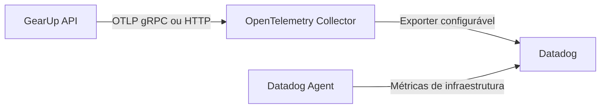

# OpenTelemetry Collector e Datadog

## Objetivo

Centralizar o recebimento e o processamento da telemetria do GearUp em um componente independente do fornecedor de observabilidade.

## Arquitetura

O código da aplicação utiliza o SDK do OpenTelemetry e envia logs, métricas e traces por OTLP. A API não utiliza bibliotecas, credenciais ou endpoints de ingestão específicos do Datadog.

No ambiente Docker local, `docker-compose.observability.yml` adiciona o Collector à mesma rede do Compose principal. A API acessa o serviço pelo DNS interno do Docker usando `http://otel-collector:4317`, sem depender de `localhost` ou `host.docker.internal`.

O OpenTelemetry Collector é responsável por:

- receber OTLP/gRPC na porta `4317` e OTLP/HTTP na porta `4318`;
- limitar o consumo de memória;
- agrupar dados em lotes antes do envio;
- calcular métricas de traces exigidas pela integração atual;
- exportar os três sinais de telemetria para o fornecedor configurado.

O Datadog Agent permanece separado e coleta somente métricas da infraestrutura Docker. A chave do fornecedor é fornecida ao Collector e ao Agent por variável de ambiente e nunca é entregue à API.

## Portabilidade

Para trocar o Datadog por New Relic, Grafana ou outro backend compatível com OpenTelemetry:

1. Manter a instrumentação existente da API.
2. Manter `OTEL_EXPORTER_OTLP_ENDPOINT` apontando para o Collector.
3. Substituir o exporter em `otel-collector-config.yaml`.
4. Substituir as credenciais e os componentes de infraestrutura específicos do fornecedor.
5. Recriar ou migrar dashboards, consultas, monitores e alertas.

Essa separação reduz o acoplamento da aplicação, mas não torna os recursos de visualização e alerta automaticamente portáveis, pois cada plataforma possui linguagem de consulta e modelo de dashboard próprios.

## Segurança

- `DD_API_KEY` deve existir apenas no arquivo `.env` local ou em um gerenciador de segredos.
- O arquivo `.env` não deve ser versionado.
- As portas OTLP e de saúde são publicadas somente em `127.0.0.1` no ambiente local.
- O arquivo `.env.example` contém apenas os nomes das variáveis, sem credenciais reais.
