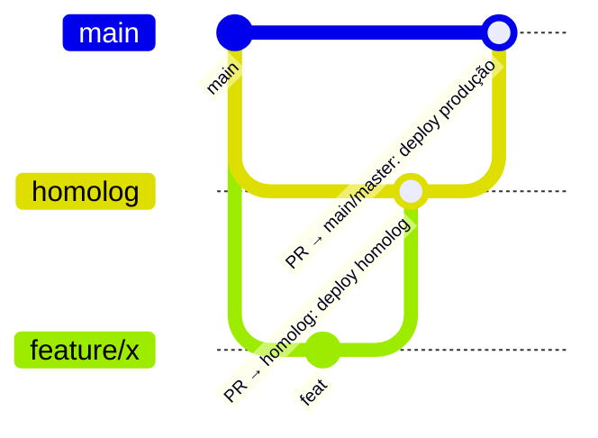

# Guia de Deploy e Operação (AWS Academy Learner Lab)

Passo a passo para subir, demonstrar e desligar a plataforma. Todos os comandos rodam no **Windows PowerShell 5.1** (o que vem no Windows); para chamadas HTTP usamos `curl.exe`.

> **Orçamento:** a plataforma completa custa ~US$ 0,25/h. EKS e RDS **cobram com o lab desligado**. Termine toda sessão com o [destroy](#5-desligar-tudo-fim-da-sessão).

## 1. Pré-requisitos (uma vez)

- AWS CLI v2, `kubectl`, GitHub CLI (`gh auth login`) e, para rodar Terraform localmente, Terraform ≥ 1.10.
- Acesso de admin aos 4 repositórios da organização [SOAT-GearUp](https://github.com/SOAT-GearUp).
- (Opcional) conta Datadog: API key e Application key.

## 2. Início de cada sessão do lab

1. No Learner Lab: **Start Lab** e aguarde o indicador verde.
2. **AWS Details → AWS CLI → Show**: copie o bloco para `%USERPROFILE%\.aws\credentials` (perfil `[default]`).
3. Distribua as credenciais para as pipelines dos 4 repositórios:

```powershell
cd GearUp
.\scripts\atualizar-secrets-aws.ps1
# com Datadog:
.\scripts\atualizar-secrets-aws.ps1 -DatadogApiKey "<api key>" -DatadogAppKey "<app key>"
```

As credenciais expiram com a sessão (máx. 4 h). `ExpiredToken` numa pipeline = repetir este passo e clicar em **Re-run jobs**.

## 3. Primeiro deploy (ordem obrigatória)

Cada passo é um **merge de Pull Request na branch principal** (ou *Actions → Run workflow*):

| # | Repositório | Workflow | Tempo | Cria |
|---|---|---|---|---|
| 1 | gearup-infra-k8s | Terraform (EKS) → apply | ~15 min | VPC, EKS, nós, ECR, metrics-server, Collector, Datadog Agent, dashboards |
| 2 | gearup-infra-db | Terraform (RDS) → apply | ~8 min | RDS PostgreSQL + `/gearup/banco/*` |
| 3 | GearUp | CD → `homolog` e depois `master` | ~6 min cada | imagem no ECR, namespaces, NLBs, `/gearup/<amb>/api/host` e `/jwt/chave` |
| 4 | gearup-lambda-auth | CI/CD Lambda → `homolog` e `main` | ~2 min cada | Lambdas, API Gateway, alarmes, `/gearup/<amb>/gateway/url` |

Depois do passo 4, a URL do gateway aparece no resumo do job e em:

```powershell
aws ssm get-parameter --name /gearup/homolog/gateway/url --query Parameter.Value --output text
```

## 4. Fluxo de desenvolvimento



- `main`/`master` são **protegidas**: sem push direto, merge só via Pull Request com o CI verde.
- `homolog` recebe merges de features e **faz deploy automático em homologação**.
- O PR `homolog → main/master` promove para produção (deploy automático no merge). Na API, a imagem já publicada em homolog é reaproveitada (mesma tag = mesmo SHA).

## 5. Desligar tudo (fim da sessão)

Ordem **inversa** — a VPC só pode ser apagada depois que nada mais a usa:

| # | Repositório | Workflow → inputs |
|---|---|---|
| 1 | gearup-lambda-auth | CI/CD Lambda → `ambiente=homolog, acao=destroy`; repetir com `production` |
| 2 | GearUp | CD → `ambiente=homolog, acao=destroy`; repetir com `production` (remove os NLBs) |
| 3 | gearup-infra-db | Terraform (RDS) → `destroy` |
| 4 | gearup-infra-k8s | Terraform (EKS) → `destroy` |

> As ENIs de uma Lambda em VPC podem levar até ~20 min para serem liberadas pela AWS. Se o destroy do `gearup-infra-k8s` falhar com `DependencyViolation` na subnet/security group, aguarde e rode de novo.

Conferência final (deve voltar vazio):

```powershell
aws eks list-clusters --query clusters
aws rds describe-db-instances --query "DBInstances[].DBInstanceIdentifier"
aws elbv2 describe-load-balancers --query "LoadBalancers[].LoadBalancerName"
```

Se algum state se perder: **Resource Groups & Tag Editor** → região us-east-1 → tag `Projeto = GearUp` → apagar o que sobrou.

## 6. Diagnóstico rápido

```powershell
aws eks update-kubeconfig --region us-east-1 --name gearup-eks
kubectl get pods,hpa,svc -n gearup-homolog
kubectl logs -n gearup-homolog deploy/gearup-api --tail=50
kubectl logs -n observabilidade deploy/otel-collector --tail=50

# Logs da Lambda (últimos 10 min)
aws logs tail /aws/lambda/gearup-auth-cpf-homolog --since 10m

# Senha do admin do ambiente (login de funcionário)
aws ssm get-parameter --name /gearup/homolog/api/senha-admin --with-decryption --query Parameter.Value --output text
```

| Sintoma | Causa provável |
|---|---|
| `/auth/cpf` responde 503 `BANCO_INDISPONIVEL` | RDS parado/apagado ou database do ambiente ainda não criado (suba a API primeiro) |
| Pipeline da Lambda: `ParameterNotFound /gearup/<amb>/api/host` | o CD da API ainda não rodou nesse ambiente |
| HPA mostra `<unknown>` | addon metrics-server ainda iniciando (1–2 min) |
| `/api/*` retorna 403 pelo gateway | token de outro ambiente (as chaves JWT são diferentes) |
